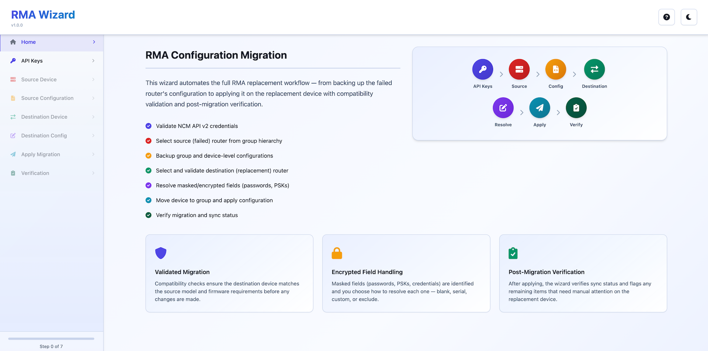

# RMA Wizard



Web-based tool for migrating configuration from a failed Cradlepoint router (source) to its RMA replacement router (destination) using the NCM API v2.

## Overview

When a router fails in the field and is replaced via RMA, this wizard guides the operator through migrating the original device's configuration to the replacement unit. It validates device compatibility (same model, same or newer firmware) and backs up both group-level and device-level configurations before migration.

## Workflow

1. **API Keys** - Enter and validate NCM v2 credentials (X-CP and X-ECM key pairs)
2. **Source Device** - Select the failed router by drilling down through the group hierarchy
3. **Source Configuration** - Review the backed-up group and device-level configurations
4. **Destination Device** - Select the replacement router and validate compatibility

## Requirements

- Python 3.6 or higher
- `requests` library (used by ncm.py)
- NCM API v2 credentials (X-CP-API-ID, X-CP-API-KEY, X-ECM-API-ID, X-ECM-API-KEY)
- Web browser

## Usage

```bash
# From the rma_wizard directory
python rma_wizard.py

# Open browser to http://localhost:8080
```

## Compatibility Checks

The wizard validates the destination device against these requirements:

- **Same Model** - The replacement router must be the same product/model as the source device
- **Same or Newer Firmware** - The destination must be running firmware equal to or newer than the source router

If either check fails, clear error messages are displayed to the operator.

## API Endpoints

| Method | Path | Description |
|--------|------|-------------|
| GET | `/api/health` | Server health check |
| POST | `/api/validate-api-keys` | Test NCM v2 API key connectivity |
| POST | `/api/get-groups` | List all groups in the account |
| POST | `/api/get-routers` | List routers for a given group |
| POST | `/api/get-router-details` | Get full details for a specific router |
| POST | `/api/get-config` | Get group config and device config |
| POST | `/api/validate-destination` | Validate destination router compatibility |

## Security Notes

- This wizard runs **locally only** and is never deployed to routers
- API keys are held in browser/server memory during runtime only
- Never include `rma_wizard.py`, `index.html`, or `static/` in SDK packages for router deployment

## File Structure

```
rma_wizard/
├── rma_wizard.py          # Web server with API endpoints
├── ncm.py                 # NCM API client library
├── package.ini            # SDK package metadata
├── index.html             # Single-page web interface
├── readme.md              # This file
├── assets/
│   └── screenshot.png     # Web interface screenshot
└── static/
    ├── css/
    │   └── style.css      # Application styles with dark mode
    ├── js/
    │   └── app.js         # Client-side application logic
    └── libs/
        ├── jquery-3.5.1.min.js
        ├── font-awesome.min.css
        └── webfonts/
```
